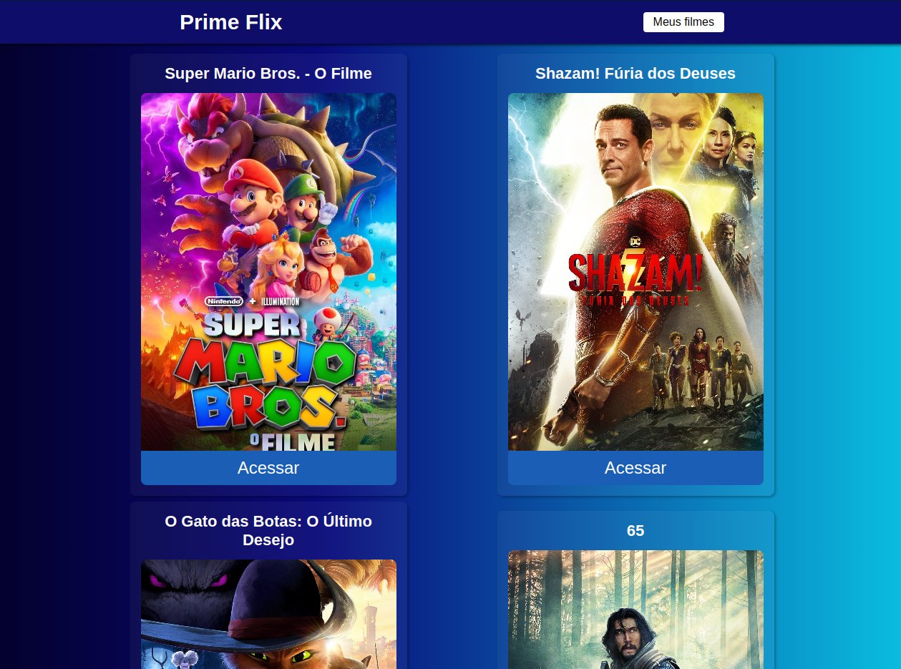

<h1 align="center"> Prime Flix </h1>

Projeto que mostra os filme que estão em cartaz nos cinemas.  

  <a href="#-tecnologias">Tecnologias</a>&nbsp;&nbsp;&nbsp;|&nbsp;&nbsp;&nbsp;
  <a href="#-projeto">Projeto</a>&nbsp;&nbsp;&nbsp;|&nbsp;&nbsp;&nbsp;

 

  

## 🚀 Tecnologias

Esse projeto foi desenvolvido com as seguintes tecnologias:

- HTML e CSS
- JavaScript
- React utilizando vite
- Netlify
- Git e Github

## 💻 Projeto

O Prime Flix é um projeto que mostra os filme que estão em cartaz nos cinemas. É possível acessar os filmes e visualizar a sinopse como também a avaliação que o filme recebeu.
Dentro da pagina de detalhes dos filmes, é possível salvar o filme que mais gostou e visualiza-lo posteriomente em 'Meus filmes', pois os filmes salvos ficam armazenados no localStorage da pagina.
É possível também, visualizar os trailers dos filmes acessados.

- [Acesse o projeto aqui.](https://mvflix.netlify.app)
